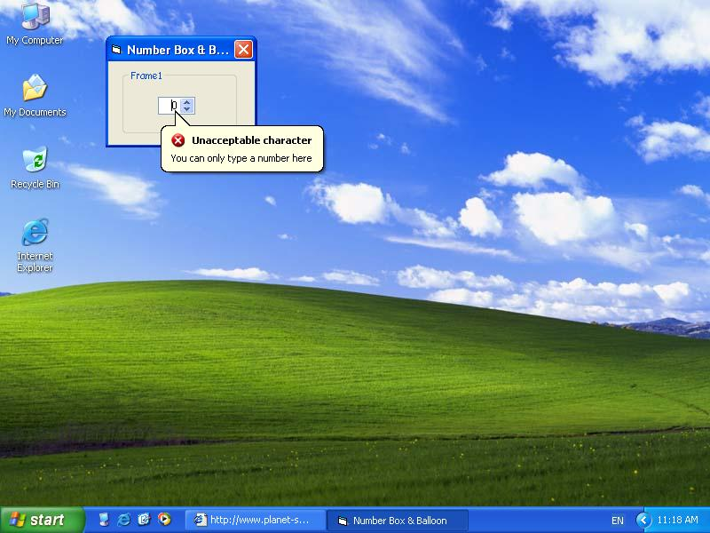



## XP NumberBox

### Description

You can only type numbers in this textbox. Make sure to make EXE file to see balloon tooltip.
 
### More Info
 

             |
---                |---
**Submitted On**   |2003-06-08 12:50:08
**By**             |[Hom](https://github.com/Planet-Source-Code/PSCIndex/blob/master/ByAuthor/hom.md)
**Level**          |Beginner
**User Rating**    |4.8 (19 globes from 4 users)
**Compatibility**  |VB 6\.0
**Category**       |[Miscellaneous](https://github.com/Planet-Source-Code/PSCIndex/blob/master/ByCategory/miscellaneous__1-1.md)
**World**          |[Visual Basic](https://github.com/Planet-Source-Code/PSCIndex/blob/master/ByWorld/visual-basic.md)
**Archive File**   |[XP\_NumberB1601856162003\.zip](https://github.com/Planet-Source-Code/hom-xp-numberbox__1-46078/archive/master.zip)

